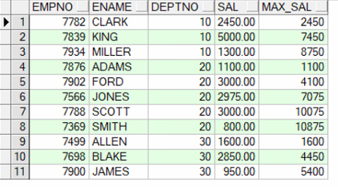
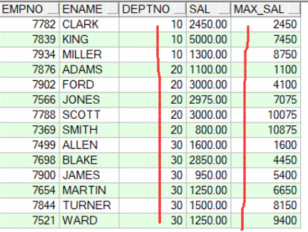
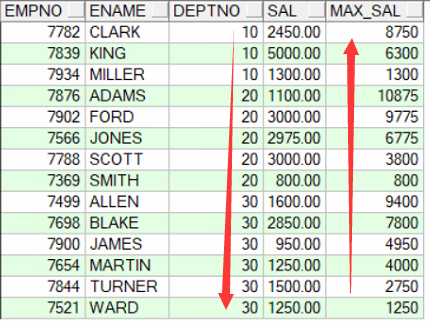
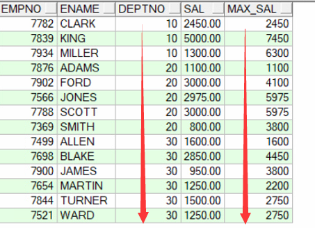
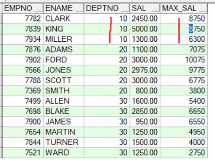
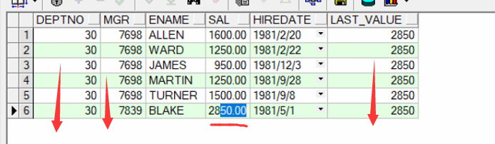
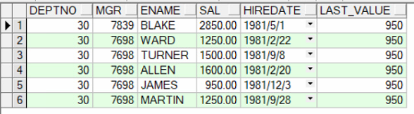
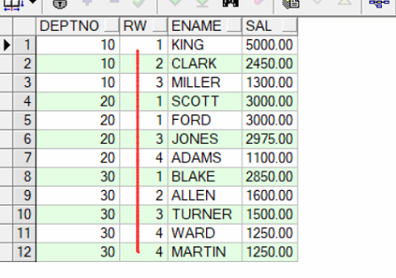
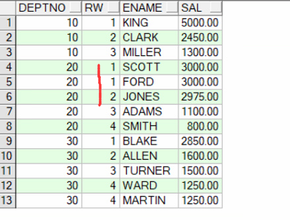
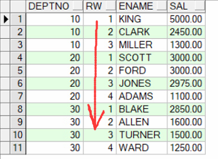

#一、Oracle分析函数入门

**分析函数是什么？**
分析函数是Oracle专门用于解决复杂报表统计需求的功能强大的函数，它可以在数据中进行分组然后计算基于组的某种统计值，并且每一组的每一行都可以返回一个统计值。

**分析函数和聚合函数的不同之处是什么？**
普通的聚合函数用group by分组，每个分组返回一个统计值，而分析函数采用partition by分组，并且每组每行都可以返回一个统计值。

**分析函数的形式**
分析函数带有一个开窗函数over()，包含三个分析子句:分组(partition by), 排序(order by), 窗口(rows) ，他们的使用形式如下：
```
over(partition by xxx order by yyy rows between zzz)。
```
<font color=#A52A2A >注：窗口子句在这里我只说rows方式的窗口,range方式和滑动窗口也不提</font>
    
**分析函数例子(在scott用户下模拟)**
<font color=#A52A2A >示例目的：显示各部门员工的工资，并附带显示该部分的最高工资。</font>
```
--显示各部门员工的工资，并附带显示该部分的最高工资。
SELECT E.DEPTNO,
       E.EMPNO,
       E.ENAME,
       E.SAL,
       LAST_VALUE(E.SAL) 
       OVER(PARTITION BY E.DEPTNO 
            ORDER BY E.SAL ROWS 
            --unbounded preceding and unbouned following针对当前所有记录的前一条、后一条记录，也就是表中的所有记录
            --unbounded：不受控制的，无限的
            --preceding：在...之前
            --following：在...之后
            BETWEEN UNBOUNDED PRECEDING AND UNBOUNDED FOLLOWING) MAX_SAL
  FROM EMP E;
```

<font color=#A52A2A >示例目的：按照deptno分组，然后计算每组值的总和</font>
```
SELECT EMPNO,
       ENAME,
       DEPTNO,
       SAL,
       SUM(SAL) OVER(PARTITION BY DEPTNO ORDER BY ENAME) max_sal
  FROM SCOTT.EMP;
```
运行结果：


<font color=#A52A2A >示例目的：对各部门进行分组，并附带显示第一行至当前行的汇总</font>
```
SELECT EMPNO,
       ENAME,
       DEPTNO,
       SAL,
       --注意ROWS BETWEEN unbounded preceding AND current row  是指第一行至当前行的汇总
       SUM(SAL) OVER(PARTITION BY DEPTNO 
                     ORDER BY ENAME 
                     ROWS BETWEEN UNBOUNDED PRECEDING AND CURRENT ROW) max_sal
  FROM SCOTT.EMP;
```
运行结果：


<font color=#A52A2A >示例目标：当前行至最后一行的汇总</font>
```
SELECT EMPNO,
       ENAME,
       DEPTNO,
       SAL,
       --注意ROWS BETWEEN current row AND unbounded following 指当前行到最后一行的汇总
       SUM(SAL) OVER(PARTITION BY DEPTNO 
                     ORDER BY ENAME 
                     ROWS BETWEEN CURRENT ROW AND UNBOUNDED FOLLOWING) max_sal
  FROM SCOTT.EMP;
```
运行结果：



<font color=#A52A2A >示例目标：当前行的上一行(rownum-1)到当前行的汇总</font>
```
SELECT EMPNO,
       ENAME,
       DEPTNO,
       SAL,
       --注意ROWS BETWEEN 1 preceding AND current row 是指当前行的上一行(rownum-1)到当前行的汇总 
       SUM(SAL) OVER(PARTITION BY DEPTNO 
                     ORDER BY ENAME ROWS 
                     BETWEEN 1 PRECEDING AND CURRENT ROW) max_sal
  FROM SCOTT.EMP;
```
运行结果：


    
<font color=#A52A2A >示例目标：   当前行的上一行(rownum-1)到当前行的下辆行(rownum+2)的汇总</font>
```
SELECT EMPNO,
       ENAME,
       DEPTNO,
       SAL,
       --注意ROWS BETWEEN 1 preceding AND 1 following 是指当前行的上一行(rownum-1)到当前行的下辆行(rownum+2)的汇总
       SUM(SAL) OVER(PARTITION BY DEPTNO 
                     ORDER BY ENAME 
                     ROWS BETWEEN 1 PRECEDING AND 2 FOLLOWING) max_sal
  FROM SCOTT.EMP;
```
运行结果：



#二、理解over()函数

##1.1、两个order by的执行时机
分析函数（以及与其配合的开窗函数over（））是在整个sql查询结束后(sql语句中的order by的执行比较特殊)再进行的操作, 也就是说sql语句中的order by也会影响分析函数的执行结果：

1. 两者一致：如果sql语句中的order by满足与分析函数配合的开窗函数over（）分析时要求的排序，即sql语句中的order by子句里的内容和开窗函数over（）中的order by子句里的内容一样，那么sql语句中的排序将先执行,分析函数在分析时就不必再排序。

2. 两者不一致：如果sql语句中的order by不满足与分析函数配合的开窗函数over（）分析时要求的排序，即sql语句中的order by子句里的内容和开窗函数over（）中的order by子句里的内容不一样，那么sql语句中的排序将最后在分析函数分析结束后执行排序。

##1.2、开窗函数over（）分析函数中的分组/排序/窗口

开窗函数over（）分析函数包含三个分析子句：分组子句(partition by)， 排序子句(order by)， 窗口子句(rows)。

窗口就是分析函数分析时要处理的数据范围，就拿sum(  )来说,它是sum(  )窗口中的记录而不是整个分组中的记录，因此我们在想得到某个栏位的累计值时，我们需要把窗口指定到该分组中的第一行数据到当前行, 如果你指定该窗口从该分组中的第一行到最后一行,那么该组中的每一个sum值都会一样，即整个组的总和。

窗口子句在这里我只说rows方式的窗口，range方式和滑动窗口也不提。

窗口子句中我们经常用到指定第一行，当前行，最后一行这样的三个属性：

1. 第一行是 unbounded preceding;
2. 当前行是 current ro;
3. 最后一行是 unbounded following;

当开窗函数over（）出现分组(partition by)子句时，unbounded preceding即第一行是指表中一个分组里的第一行， unbounded following即最后一行是指表中一个分组里的最后一行；

当开窗函数over（）省略了分组(partition by)子句时， unbounded preceding即第一行是指表中的第一行， unbounded following即最后一行是指表中的最后一行。

**窗口子句不能单独出现，必须有order by子句时才能出现，例如:**
```
last_value(sal) over(partition by deptno 
                     order by sal 
                     rows between unbounded preceding and unbounded following)
```
以上示例指定窗口为整个分组。而出现order by子句的时候，不一定要有窗口子句，但效果会很不一样，此时的窗口默认是当前组的第一行到当前行！

如果省略分组,则把全部记录当成一个组。

而无论是否省略分组子句，如下结论都是成立的：

1. 窗口子句不能单独出现，必须有order by子句时才能出现。
2. 当省略窗口子句时；如果存在order by则默认的窗口是（unbounded preceding and current row  ）当前组的第一行到当前行；如果同时省略order by则默认的窗口是（unbounded preceding and unbounded following  ）整个组。

<font color=#A52A2A >例1：关注点：sql有排序（正序），over()排序子句无，先做sql排序再进行分析函数运算</font>
```
SELECT DEPTNO,
       MGR,
       ENAME,
       SAL,
       HIREDATE,
       LAST_VALUE(SAL) OVER(PARTITION BY DEPTNO) LAST_VALUE
  FROM EMP
 WHERE DEPTNO = 30
 ORDER BY DEPTNO, MGR
```
运行结果：



<font color=#A52A2A >例2：关注点：sql有排序（倒序），over()排序子句有，窗口子句无，此时的运算是：sql先选数据但是不排序，而后排序子句先排序并进行分析函数处理（窗口默认为第一行到当前行），最后再进行sql排序</font>
```
SELECT DEPTNO,
       MGR,
       ENAME,
       SAL,
       HIREDATE,
       MIN(SAL) OVER(PARTITION BY DEPTNO ORDER BY SAL ASC) LAST_VALUE
  FROM EMP
 WHERE DEPTNO = 30
 ORDER BY DEPTNO, MGR DESC
```
运行结果：


#三、常见分析函数详解

为了方便进行实践，特将演示表和数据罗列如下：

##一、创建表
```
create table t( 
   bill_month varchar2(12) , 
   area_code number, 
   net_type varchar(2), 
   local_fare number 
)
```
      
##二、插入数据
```
insert into t values('200405',5761,'G', 7393344.04); 
insert into t values('200405',5761,'J', 5667089.85); 
insert into t values('200405',5762,'G', 6315075.96); 
insert into t values('200405',5762,'J', 6328716.15); 
insert into t values('200405',5763,'G', 8861742.59); 
insert into t values('200405',5763,'J', 7788036.32); 
insert into t values('200405',5764,'G', 6028670.45); 
insert into t values('200405',5764,'J', 6459121.49); 
insert into t values('200405',5765,'G', 13156065.77); 
insert into t values('200405',5765,'J', 11901671.70); 
insert into t values('200406',5761,'G', 7614587.96); 
insert into t values('200406',5761,'J', 5704343.05); 
insert into t values('200406',5762,'G', 6556992.60); 
insert into t values('200406',5762,'J', 6238068.05); 
insert into t values('200406',5763,'G', 9130055.46); 
insert into t values('200406',5763,'J', 7990460.25); 
insert into t values('200406',5764,'G', 6387706.01); 
insert into t values('200406',5764,'J', 6907481.66); 
insert into t values('200406',5765,'G', 13562968.81); 
insert into t values('200406',5765,'J', 12495492.50); 
insert into t values('200407',5761,'G', 7987050.65); 
insert into t values('200407',5761,'J', 5723215.28); 
insert into t values('200407',5762,'G', 6833096.68); 
insert into t values('200407',5762,'J', 6391201.44); 
insert into t values('200407',5763,'G', 9410815.91); 
insert into t values('200407',5763,'J', 8076677.41); 
insert into t values('200407',5764,'G', 6456433.23); 
insert into t values('200407',5764,'J', 6987660.53); 
insert into t values('200407',5765,'G', 14000101.20); 
insert into t values('200407',5765,'J', 12301780.20); 
insert into t values('200408',5761,'G', 8085170.84); 
insert into t values('200408',5761,'J', 6050611.37); 
insert into t values('200408',5762,'G', 6854584.22); 
insert into t values('200408',5762,'J', 6521884.50); 
insert into t values('200408',5763,'G', 9468707.65); 
insert into t values('200408',5763,'J', 8460049.43); 
insert into t values('200408',5764,'G', 6587559.23); 
insert into t values('200408',5764,'J', 7342135.86); 
insert into t values('200408',5765,'G', 14450586.63); 
insert into t values('200408',5765,'J', 12680052.38); 
commit;
```
###三、first_value()与last_value()：求最值对应的其他属性
<font color=#A52A2A >问题、取出每月通话费最高和最低的两个地区。</font>
```
SELECT BILL_MONTH, 
       AREA_CODE,
       SUM(LOCAL_FARE) LOCAL_FARE, 
       FIRST_VALUE(AREA_CODE) 
       OVER(PARTITION BY BILL_MONTH 
            ORDER BY SUM(LOCAL_FARE) DESC 
            ROWS BETWEEN UNBOUNDED PRECEDING AND UNBOUNDED FOLLOWING) FIRSTVAL, 
       LAST_VALUE(AREA_CODE) 
       OVER(PARTITION BY BILL_MONTH 
            ORDER BY SUM(LOCAL_FARE) DESC 
            ROWS BETWEEN UNBOUNDED PRECEDING AND UNBOUNDED FOLLOWING) LASTVAL 
  FROM T 
 GROUP BY BILL_MONTH, AREA_CODE 
 ORDER BY BILL_MONTH
```
运行结果：


##四、rank(),dense_rank()与row_number()：求排序
rank，dense_rank，row_number函数为每条记录产生一个从1开始至n的自然数，n的值可能小于等于记录的总数。这3个函数的唯一区别在于当碰到相同数据时的排名策略。

1. row_number : 返回一个唯一的值，当碰到相同数据时，排名按照记录集中记录的顺序依次递增。
2. dense_rank：返回一个唯一的值，当碰到相同数据时，此时所有相同数据的排名都是一样的。
3. rank： rank函数返回一个唯一的值，当碰到相同的数据时，此时所有相同数据的排名是一样的，同时会在最后一条相同记录和下一条不同记录的排名之间空出排名。

**演示数据在Oracle自带的scott用户下：**
<font color=#A52A2A >rank()值相同时排名相同，其后排名跳跃不连续</font>
```
SELECT * 
  FROM (SELECT DEPTNO, 
               RANK() OVER(PARTITION BY DEPTNO ORDER BY SAL DESC) RW, 
               ENAME,
               SAL
          FROM SCOTT.EMP) 
 WHERE RW <= 4
```
运行结果：


<font color=#A52A2A >dense_rank()值相同时排名相同，其后排名连续不跳跃</font>
```
SELECT * 
  FROM (SELECT DEPTNO, 
               DENSE_RANK() OVER(PARTITION BY DEPTNO ORDER BY SAL DESC) RW, 
               ENAME,
               SAL
          FROM SCOTT.EMP) 
 WHERE RW <= 4
```
运行结果：


<font color=#A52A2A >row_number()值相同时排名不相等，其后排名连续不跳跃</font>
```
SELECT * 
  FROM (SELECT DEPTNO, 
               ROW_NUMBER() OVER(PARTITION BY DEPTNO ORDER BY SAL DESC) RW, 
               ENAME,
               SAL
          FROM SCOTT.EMP) 
 WHERE RW <= 4
```
运行结果：
